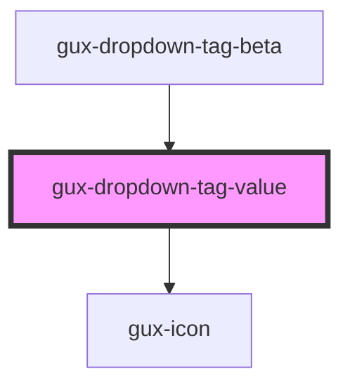

# gux-dropdown-multi-tag

<!-- Auto Generated Below -->

## Properties

| Property         | Attribute         | Description       | Type      | Default |
| ---------------- | ----------------- | ----------------- | --------- | ------- |
| `disabled`       | `disabled`        | Tag is removable. | `boolean` | `false` |
| `optionSelected` | `option-selected` |                   | `string`  | `''`    |
| `value`          | `value`           |                   | `string`  | `''`    |

## Events

| Event             | Description                           | Type                  |
| ----------------- | ------------------------------------- | --------------------- |
| `tagCloseClicked` | Triggered when click on remove button | `CustomEvent<string>` |

## Dependencies

### Used by

 - [gux-dropdown-tag-beta](..)

### Depends on

- [gux-icon](../../../stable/gux-icon)

### Graph

----------------------------------------------

*Built with [StencilJS](https://stenciljs.com/)*
