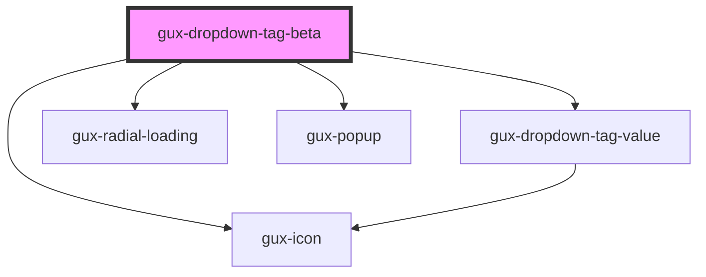

# gux-dropdown-multi

<!-- Auto Generated Below -->

## Properties

| Property      | Attribute     | Description                                                           | Type                                  | Default     |
| ------------- | ------------- | --------------------------------------------------------------------- | ------------------------------------- | ----------- |
| `disabled`    | `disabled`    |                                                                       | `boolean`                             | `false`     |
| `filterType`  | `filter-type` | Override default filtering behavior                                   | `"custom" \| "none" \| "starts-with"` | `'none'`    |
| `filterable`  | `filterable`  | deprecated will be removed in v4 (COMUI-1369). Use filterType instead | `boolean`                             | `false`     |
| `hasError`    | `has-error`   |                                                                       | `boolean`                             | `false`     |
| `loading`     | `loading`     |                                                                       | `boolean`                             | `false`     |
| `placeholder` | `placeholder` |                                                                       | `string`                              | `undefined` |
| `required`    | `required`    |                                                                       | `boolean`                             | `false`     |
| `value`       | `value`       |                                                                       | `string`                              | `undefined` |

## Events

| Event             | Description                                                                   | Type                  |
| ----------------- | ----------------------------------------------------------------------------- | --------------------- |
| `guxcollapsed`    | This event will run when the dropdown-multi transitions to a collapsed state. | `CustomEvent<void>`   |
| `guxcreateoption` | This event is emitted to request creating a new option                        | `CustomEvent<any>`    |
| `guxexpanded`     | This event will run when the dropdown-multi transitions to an expanded state. | `CustomEvent<void>`   |
| `guxfilter`       |                                                                               | `CustomEvent<string>` |

## Methods

### `getSelectedValues() => Promise<string[]>`

Returns an array of the selected values

#### Returns

Type: `Promise<string[]>`

## Slots

| Slot | Description                                                  |
| ---- | ------------------------------------------------------------ |
|      | for a gux-listbox-multi containing gux-option-multi children |

## Dependencies

### Depends on

- [gux-dropdown-tag-value](gux-dropdown-tag-value)
- [gux-icon](../../stable/gux-icon)
- [gux-radial-loading](../../stable/gux-radial-loading)
- [gux-popup](../../stable/gux-popup)

### Graph

----------------------------------------------

*Built with [StencilJS](https://stenciljs.com/)*
